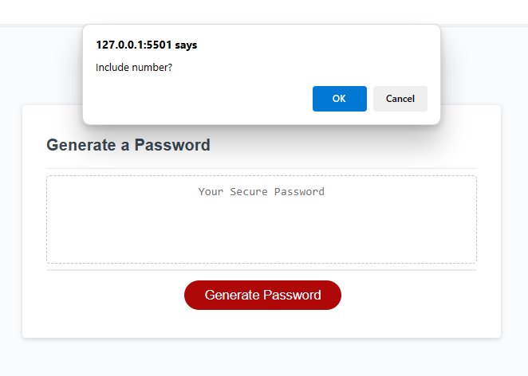
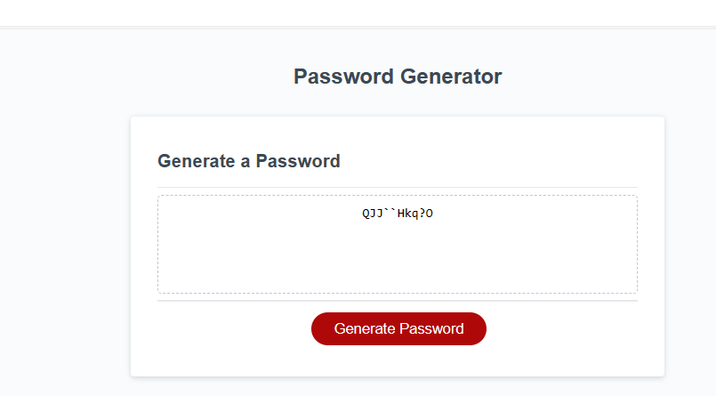

# 03 JavaScript: Password Generator


## LINK TO MY PASSWORD GENERATOR


 https://daisyisibor.github.io/Password-Generator/

## Description

This Password Generator is a tool designed to assist users in creating new, secure passwords. It offers a user-friendly interface where users can customize various criteria for generating their passwords, ensuring they meet their security needs.

## How to Use
 1. Click the button labeled "Generate Password" to start the password generation process.

 2.Follow the prompts to select the desired criteria for your password, including length and character types.

<<<<<<< HEAD
 3.Ensure that you meet the minimum requirements for password length and character type selection.
=======
## Compulsory
  There is a compulsory criteria on the selection in order to generate a passowrd. one of the criteria must be selected between ( Uppercase, Lowercase, numbers and special characters) If one is not selected to be included on the password and error message "UNDEFINED" will display in the box. 
>>>>>>> fbff9683bbf8ab4af564912c14d69500d0f89922

 4.Once all prompts are answered, a password matching the selected criteria will be generated.

 5.The generated password will either be displayed in an alert message or written to the page, depending on the implementation

  
## images on how to use







## Your Task


This week's Challenge requires you to modify starter code to create an application that enables employees to generate random passwords based on criteria that they’ve selected. This app will run in the browser and will feature dynamically updated HTML and CSS powered by JavaScript code that you write. It will have a clean and polished, responsive user interface that adapts to multiple screen sizes.


The password can include special characters. If you’re unfamiliar with these, see this [list of password special characters](https://www.owasp.org/index.php/Password_special_characters) from the OWASP Foundation.

## User Story

```
AS AN employee with access to sensitive data
I WANT to randomly generate a password that meets certain criteria
SO THAT I can create a strong password that provides greater security
```

## Acceptance Criteria

```
GIVEN I need a new, secure password
WHEN I click the button to generate a password
THEN I am presented with a series of prompts for password criteria
WHEN prompted for password criteria
THEN I select which criteria to include in the password
WHEN prompted for the length of the password
THEN I choose a length of at least 8 characters and no more than 128 characters
WHEN asked for character types to include in the password
THEN I confirm whether or not to include lowercase, uppercase, numeric, and/or special characters
WHEN I answer each prompt
THEN my input should be validated and at least one character type should be selected
WHEN all prompts are answered
THEN a password is generated that matches the selected criteria
WHEN the password is generated
THEN the password is either displayed in an alert or written to the page
```


## Note

This tool is designed to create secure passwords based on user-defined criteria, enhancing security and reducing the risk of password compromise.
Users are encouraged to choose strong passwords and to avoid sharing them with others to maintain the integrity of their accounts and data.


## Grading Requirements

> **Note**: If a Challenge assignment submission is marked as “0”, it is considered incomplete and will not count towards your graduation requirements. Examples of incomplete submissions include the following:
>
> * A repository that has no code
>
> * A repository that includes a unique name but nothing else
>
> * A repository that includes only a README file but nothing else
>
> * A repository that only includes starter code

This Challenge is graded based on the following criteria: 

### Technical Acceptance Criteria: 40%

* Satisfies all of the preceding acceptance criteria.

### Deployment: 32%

* Application deployed at live URL.

* Application loads with no errors.

* Application GitHub URL submitted.

* GitHub repository that contains application code.

### Application Quality: 15%

* Application user experience is intuitive and easy to navigate.

* Application user interface style is clean and polished.

* Application resembles the mock-up functionality provided in the Challenge instructions.

### Repository Quality: 13%

* Repository has a unique name.

* Repository follows best practices for file structure and naming conventions.

* Repository follows best practices for class/id naming conventions, indentation, quality comments, etc.

* Repository contains multiple descriptive commit messages.

* Repository contains quality readme file with description, screenshot, and link to deployed application.

## Review

You are required to submit the following for review:

* The URL of the deployed application.

* The URL of the GitHub repository, with a unique name and a readme describing the project.

- - -
© 2023 edX Boot Camps LLC. Confidential and Proprietary. All Rights Reserved.
